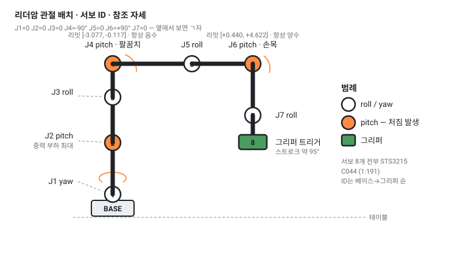
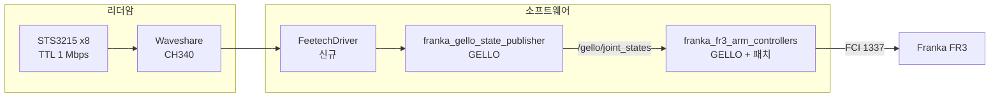
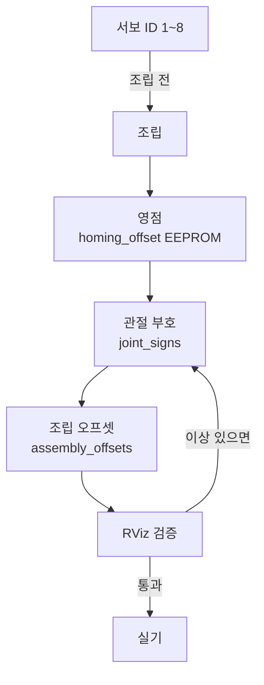
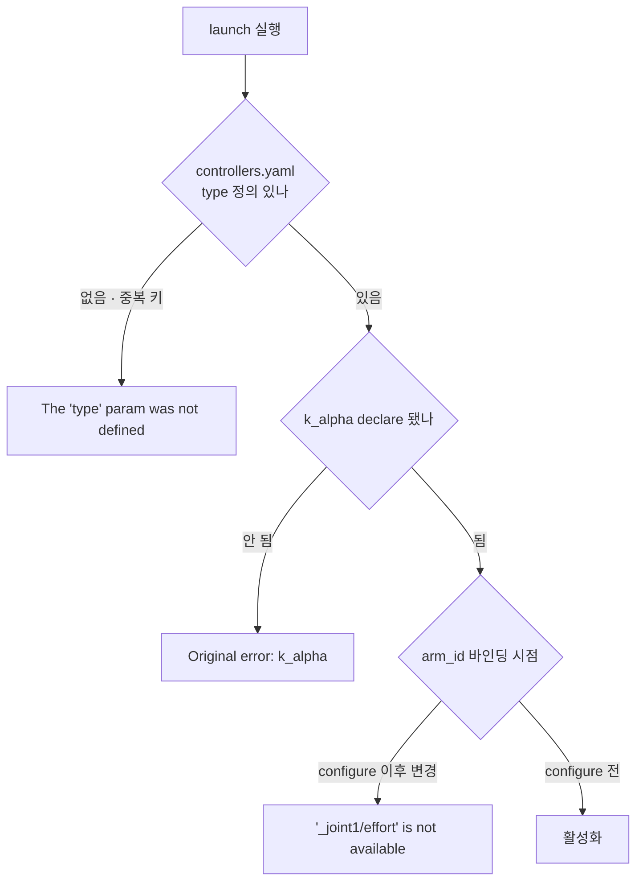
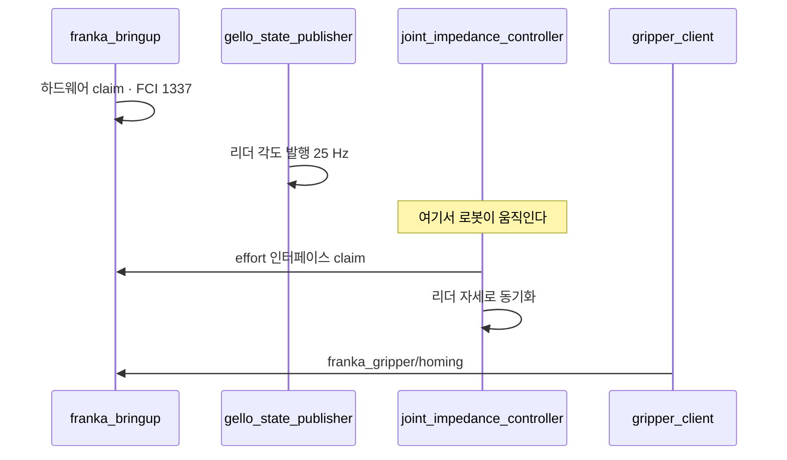

# GELLO-Feetech-FR3

[English](README.md) · **한국어**

**Feetech STS3215 · U-Arm Config3 · Franka Research 3 · ROS 2 Jazzy**

전류 제어가 없는 서보로 7-DOF GELLO 리더암을 만들어 Franka FR3를 조인트 레벨로 조종했다.
GELLO는 Dynamixel과 전류 기반 위치 제어를 전제한다. STS3215에는 그 모드가 없다.

[하드웨어](docs/hardware.md) · [캘리브레이션](docs/calibration.md) · [Jazzy 이식 기록](docs/ros2-jazzy-notes.md) · [데이터 수집](docs/data-collection.md) · [패치](patches/)

---

## 목차

| 절 | 내용 |
|---|---|
| [1. 한눈에 보기](#1-한눈에-보기) | 무엇을 만들었고 무엇이 새로운가 |
| [2. 구조](#2-구조) | 어느 계층을 가져오고 어디를 새로 짰나 |
| [3. STS3215 제약](#3-sts3215-제약) | 전류 제어 부재가 만든 세 가지 결과 |
| [4. 캘리브레이션](#4-캘리브레이션) | 부호 · 오프셋 · 그리퍼 |
| [5. Jazzy 이식](#5-jazzy-이식) | 상류 버그 2건과 빌드 문제 1건 |
| [6. 실행](#6-실행) | 기동 순서 |
| [7. 데모 데이터](#7-데모-데이터) | 100 에피소드 · 학습 주체 |
| [8. 한계](#8-한계) | 인용 전 확인 사항 |
| [9. 관련 작업](#9-관련-작업) | 선행 작업과 예정 |
| [10. 출처와 라이선스](#10-출처와-라이선스) | |

---

## 1. 한눈에 보기



### 핵심

| 항목 | 값 |
|---|---|
| 리더암 | 7관절 + 그리퍼 트리거, STS3215 C044 (1:191) × 8 |
| 기구 | U-Arm Config3 출력물 |
| sync read | 8채널 약 **760 Hz** (퍼블리셔 요구 25 Hz) |
| 팔로워 | Franka Research 3, `franka_ros2` v3.4.1, `libfranka` 0.20.5 |
| 신규 코드 | `FeetechDriver` — GELLO `DynamixelDriverProtocol` 구현 |
| 상류 수정 | `k_alpha` declare 누락, `controllers.yaml` 중복 키 |

### 세 줄 요약

```
① 전류 제어가 없다        — GELLO의 가상 스프링을 못 쓴다. 중력보상은 기계식으로 간다
② 엔코더가 단일회전이다     — 래핑을 드라이버가 흡수하지 않으면 로봇에 1회전 명령이 간다
③ 상류가 Humble 전제다     — ros2_control 4.47에서 반드시 터지는 버그가 두 개 있다
```

### 이 저장소가 답하는 질문

| 질문 | 답 |
|---|---|
| 전류 제어 없는 서보로 GELLO를 돌릴 수 있는가 | 가능하다. 대신 중력보상을 잃는다 |
| 무엇을 새로 짜야 하는가 | 드라이버 한 개. `DynamixelDriverProtocol`이 교체 지점이다 |
| GELLO를 Jazzy에서 왜 못 쓰는가 | 파라미터 declare 누락과 YAML 중복 키. 둘 다 한 줄 수정 |

---

## 2. 구조



### 계층별 출처

| 계층 | 출처 | 상태 |
|---|---|---|
| 기구 | U-Arm `Config3_STL` | Apache-2.0, 그대로 |
| 서보 SDK | U-Arm 동봉 `scservo_sdk` | Apache-2.0, 그대로 |
| **리더 드라이버** | **본 저장소** | **신규 작성** |
| 상태 퍼블리셔 | GELLO `franka_gello_state_publisher` | MIT, 드라이버만 교체 |
| 팔 제어기 | GELLO `franka_fr3_arm_controllers` | MIT, Jazzy 패치 2건 |
| 그리퍼 | GELLO `franka_gripper_manager` | MIT, 수정 없음 |
| 로봇 스택 | `franka_ros2` v3.4.1 | 런타임 의존 |

**U-Arm 소프트웨어는 사용하지 않는다.** 로드맵에 ROS 2 지원이 없고, `Follower_Arm/`에는
ARX · Dobot · LeRobot · xArm만 있어 Franka 팔로워가 존재하지 않는다. 출력물과 SDK만 가져왔다.

### 교체 지점

`gello_hardware.py`에서 한 줄이다.

```python
# 원본
self._driver = DynamixelDriver(joint_ids, port=self._com_port, baudrate=57600)
# 교체
self._driver = FeetechDriver(joint_ids, port=self._com_port, baudrate=1000000)
```

GELLO가 드라이버를 `Protocol` 뒤에 추상화해 두었고, 모터 설정을 YAML로 빼두었기 때문에
가능하다. 확장을 전제한 설계다.

---

## 3. STS3215 제약

| | Dynamixel XL330 (GELLO 기본) | Feetech STS3215 |
|---|---|---|
| 전류 / 토크 모드 | 있음 | **없음** |
| 엔코더 | 4095 카운트/회전 | 4096 카운트/회전 |
| 위치 레지스터 | 다회전 추적 | **단일회전, 4095→0 래핑** |
| 보드레이트 | 57600 | 1000000 |
| 오프셋 부호 | 4바이트 부호 | 11번 비트 |

동작 모드는 0=위치, 1=속도폐루프, 2=속도개루프, 3=스텝뿐이다.

### 결과 ① 가상 스프링을 못 쓴다

GELLO는 `OPERATING_MODE = 5`(current-based position)로 중력보상을 구현한다.
드라이버는 `operating_mode` · `goal_current` · PID 레지스터를 **받아서 저장하되 하드웨어에는
쓰지 않는다.** 예외를 던지면 `gello_hardware.py`의 초기화 순서가 깨지기 때문이다.

중력보상은 기계식(토션 스프링)으로 간다.

### 결과 ② 다회전 누적이 필요하다


`gello_hardware.py`는 관절 델타를 연속 신호 가정으로 계산한다. 래핑이 한 번 일어나면
델타가 −2π가 되고 로봇에 1회전 명령이 들어간다. 드라이버가 회전수를 누적해 연속 신호를
내보내면 상류는 손댈 필요가 없다.

### 결과 ③ 구동을 차단했다

리더암은 수동이다. 드라이버가 `torque_enable`을 0으로 강제하고
`goal_position` · `goal_speed` · `acceleration` 쓰기를 삼킨다.

**STS3215는 goal position을 쓰면 토크가 암묵적으로 켜진다.** 브링업 중 이것 때문에 팔이
예기치 않게 움직였다. 의도적인 차단이므로 풀지 말 것.

---

## 4. 캘리브레이션



ID는 **조립 전에** 굽는다. 조립 후에는 서보가 출력물 안에 묻혀 체인을 끊기 어렵다.
영점(`homing_offset`)은 **조립 후 한 번만** — EEPROM 쓰기다.

### 측정값

```yaml
joint_signs:       [1, -1, 1, -1, 1, -1, 1]
assembly_offsets:  [0.0307, 5.6941, 6.0792, 4.1924, 0.1672, 0.2163, 0.6749]  # rad
gripper_range_rad: [3.3579, 2.5617]   # [닫힘, 열림]
```

`joint_signs`가 GELLO의 Franka 기본값 `[1, -1, 1, -1, 1, 1, 1]`과 다르다. Config3는 FR3의
축소 복제가 아니라 조인트 토폴로지만 공유하므로, 서보 장착 방향을 **실측해야 한다.**

### 거울 반전 모드

roll/yaw 관절(J1, J3, J5, J7)의 부호를 FR3 양의 방향과 반대로 둔다. 1:1 매핑이 기술적으로는
맞지만 조작이 불편하다 — 조작자가 로봇을 마주 보므로 리더암을 왼쪽으로 돌리면 로봇은
오른쪽으로 간다. 네 관절을 뒤집으면 거울처럼 동작해 손의 예상과 맞는다. pitch 관절(J2, J4,
J6)은 그대로다. 위아래는 어느 쪽에서 봐도 같다.

부호를 바꾸면 보통 오프셋을 다시 재야 하지만 여기서는 아니다. 오프셋 변화량이
`−π(s_new − s_old)` = `∓2π`이고, `q_ref = 0`이면 `mod 2π`에서 0이다. roll/yaw 네 관절이
전부 `q_ref = 0`이므로 오프셋이 그대로 유효하고 참조 자세를 다시 잡을 필요가 없다.

### J7 중립 보정

`assembly_offsets[6]`은 리더암 중립 손목을 **로봇 J7 +45°**에 대응시킨다. 0이 아니다.

캘리브레이션 오차가 아니라 FR3 형상이다. `franka_description`에서 `link7`이
`rpy="0 0 π/4"`로 회전해 있고 핸드가 `−π/4`로 장착된다. J7이 0일 때 그리퍼가 45° 기울어
있다. 중립을 45° 옮기면 그리퍼가 리더암 손잡이와 정렬된다.

대가는 비대칭 가동 범위다 — 관절 리밋 ±175° 안에서 한쪽 약 220°, 다른 쪽 130°. 실사용에는
충분하다.

`tools/tune_j7.py`가 이 관절만 조정한다. 상대 이동이라 두 번 실행하면 누적되며,
`tools/watch_j7.py`로 현재 각도를 라이브로 확인할 수 있다.

### 오프셋 계산에 π가 들어간다

```
assembly_offset = (raw - (q_ref + π) × sign) mod 2π
```

`GelloHardware.normalize_joint_positions`가 `[mid−π, mid+π)`로 감싸기 때문이다. 빼먹으면
J4가 리밋 밖으로 나가 `np.clip`에 고정되고 관절이 반응하지 않는다. GELLO 기본값이
`[0, 0, 3.142, 3.142, 3.142, 4.712, 0]`으로 π와 3π/2인 것이 같은 이유다.

`measure_all.py`는 계산 결과를 `normalize_joint_positions`에 되먹여 **모든 관절이 `q_ref`로
복원되고 리밋 안에 들어올 때만 저장한다.** 검증에 실패한 값은 기록되지 않는다.

자세한 절차는 [docs/calibration.md](docs/calibration.md).

---

## 5. Jazzy 이식

GELLO의 `ros2/`는 Humble 기준이다. Jazzy + `ros2_control` 4.47.0에서 세 가지가 걸렸다.



| # | 문제 | 원인 |
|---|---|---|
| 1 | `k_alpha` declare 누락 | `on_init`이 선언하지 않는데 `on_configure`가 읽는다. 4.x는 params-file 값을 자동 declare하지 않는다 |
| 2 | `controllers.yaml` 중복 키 | `/**:` 블록이 두 개. YAML이 뒤엣것으로 덮어써 `controller_manager` 블록이 사라진다 |
| 3 | 테스트 컴파일 실패 | `init()` 시그니처 변경. `-DBUILD_TESTING=OFF`로 우회. 런타임 코드는 무관 |

1번은 **상류 버그다.** implicit declaration을 제거한 `ros2_control`이면 어디서든 터진다.
2번이 먼저 터지기 때문에 `k_alpha` 에러는 그 뒤에야 보인다.

전체 기록 — 좀비 프로세스, FCI 포트 1337/1338 구분, DDS 도메인 충돌 — 은
[docs/ros2-jazzy-notes.md](docs/ros2-jazzy-notes.md)에 있다.

---

## 6. 실행



```bash
# A — 하드웨어
ros2 launch franka_bringup franka.launch.py \
  robot_type:=fr3 robot_ip:=<ip> load_gripper:=true use_fake_hardware:=false

# B — 리더 퍼블리셔
ros2 launch franka_gello_state_publisher main.launch.py config_file:=<your>.yaml

# C — 제어기.  로봇이 움직인다.
ros2 run controller_manager spawner joint_impedance_controller \
  --param-file <path>/controllers.yaml

# D — 그리퍼
ros2 launch franka_gripper_manager franka_gripper_client.launch.py \
  config_file:=example_fr3_config_franka_hand.yaml
```

**순서가 고정이다.** 그리퍼 클라이언트는 `franka_bringup`이 띄우는
`franka_gripper/homing` 액션 서버를 기다린다. 먼저 실행하면 10초 후 죽는다.

제어기 활성화 순간 로봇이 리더암 자세로 이동한다. 활성화 전에 리더 각도가 관절 리밋에서
떨어져 있는지 확인할 것.

---

## 7. 데모 데이터

리더암으로 FR3 텔레오퍼레이션 100 에피소드를 기록했다. 검은 그릇을 집어 접시에 놓는
태스크이며 LIBERO-Spatial task 0에서 가져왔다. 카메라 2대(손목 · agentview).

### 작업 분담

| 항목 | 주체 |
|---|---|
| 리더암 제작 · 캘리브레이션 | 본 저장소 |
| ROS 2 통합 · 실기 배포 | 본 저장소 |
| 데모 100 에피소드 기록 | 본 저장소 |
| **정책 파인튜닝** | **별도 담당자, 별도 장비** |
| 체크포인트 실기 실행 | 본 저장소 |

### 결과

파인튜닝된 GR00T N1.7 체크포인트를 FR3에서 실행했다. 정책 제어 하에서 팔이 대상에
접근한다.

**파지 성공률은 측정하지 않았다.** 시행 횟수도, 성공 판정 기준도, 비교 기준선도 없다.
관찰은 정성적이다 — 접근 구간은 그럴듯하고 파지 결과는 미확인이다.

성공이라고 쓰지 않는 것은 의도적이다. 100 에피소드는 작은 데이터셋이고,
"대상 쪽으로 움직였다"는 태스크를 학습했다는 증거가 아니다.

제대로 된 평가에 무엇이 필요한지는 [docs/data-collection.md](docs/data-collection.md)에 적었다.

---

## 8. 한계

| # | 항목 | 내용 |
|---|---|---|
| 1 | **중력보상 없음** | C044(1:191)를 8개 전부에 썼다. 원 설계는 J2에 C001(1:345)이다. 손을 떼면 참조 자세가 유지되지 않는다 |
| 2 | **캘리브레이션 재현성** | pitch 관절에서 측정 간 10~17° 편차. 1번의 직접 결과다 |
| 3 | **속도 클램프 없음** | 리더 각도가 그대로 전달된다. 빠른 조작이 Franka reflex를 유발할 수 있다 |
| 4 | **1 kHz Overrun** | 제어기 로드 전에도 missed cycle이 발생한다. 시험 장비는 `PREEMPT_DYNAMIC` 커널이다 |
| 5 | **UDP 타임아웃 1회** | 브링업 중 `libfranka: UDP receive: Timeout`으로 하드웨어가 비활성화된 사례가 있다 |
| 6 | **추종 오차 미측정** | 리더–팔로워 RMS 오차와 지연을 재지 않았다 |
| 7 | **파지 성공률 미측정** | 7절 참조 |
| 8 | **회전 스케일 무관** | 조인트 레벨 매핑이므로 해당 없음. 대신 Config3가 FR3 축소 복제가 아니라 리더암 자세와 로봇 자세가 시각적으로 닮지 않는다 |

4~6번은 한 번의 `ros2 bag record`로 전부 계측 가능하다. 계획은 있고 실행은 안 했다.

---

## 9. 관련 작업

| | |
|---|---|
| [Libero-GR00T-in-IsaacSim](https://github.com/SungjinDavidLee/Libero-GR00T-in-IsaacSim) | 같은 GR00T 정책군을 Isaac Sim에 이식해 500 에피소드로 측정한 선행 작업. 시뮬레이터 이식 시 무너지는 것이 정책이 아니라 행동 공간 규약이라는 결론 |

본 저장소는 그 다음 단계다 — 시뮬에서 규약을 확인한 뒤 실물 로봇으로 옮겼다.

### 예정

- [ ] 리더–팔로워 추종 오차 · 지연 계측 (`ros2 bag`)
- [ ] J2 토션 스프링 — 중력 처짐 대응
- [ ] 속도 클램프 · 저역통과 필터
- [ ] 동일 파이프라인을 Fairino FR5로 이식

---

## 10. 출처와 라이선스

본 저장소는 원저작물(MIT, [LICENSE](LICENSE))과 두 상류 프로젝트의 파생물을 포함한다.
전체 표기는 [NOTICE](NOTICE).

| 프로젝트 | 라이선스 | 가져온 것 |
|---|---|---|
| [GELLO](https://github.com/wuphilipp/gello_software) | MIT, © 2023 Philipp Wu | ROS 2 패키지 3개, 드라이버 인터페이스 |
| [LeRobot-Anything-U-Arm](https://github.com/MINT-SJTU/LeRobot-Anything-U-Arm) | Apache-2.0, MINT-SJTU | Config3 기구, `scservo_sdk` |
| [franka_ros2](https://github.com/frankarobotics/franka_ros2) | Apache-2.0 | 런타임 의존 |

`patches/01`은 [wuphilipp/gello_software](https://github.com/wuphilipp/gello_software) PR 후보다.

---

## 저장소 구성

```
driver/     FeetechDriver · SDK 상수에서 생성한 STS3215 컨트롤 테이블
patches/    Jazzy 호환 패치와 근거
tools/      서보 ID 할당 · 부호/오프셋 측정 · 진단
config/     리더 설정 예시 · udev 규칙
docs/       하드웨어 · 캘리브레이션 · 이식 기록 · 데이터 수집
assets/     도면
```
