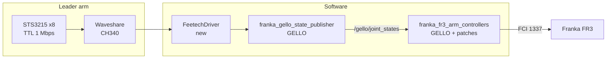
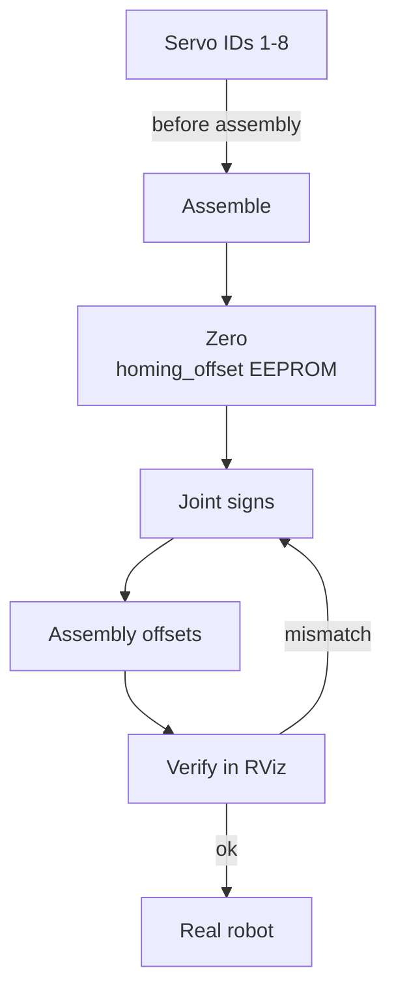
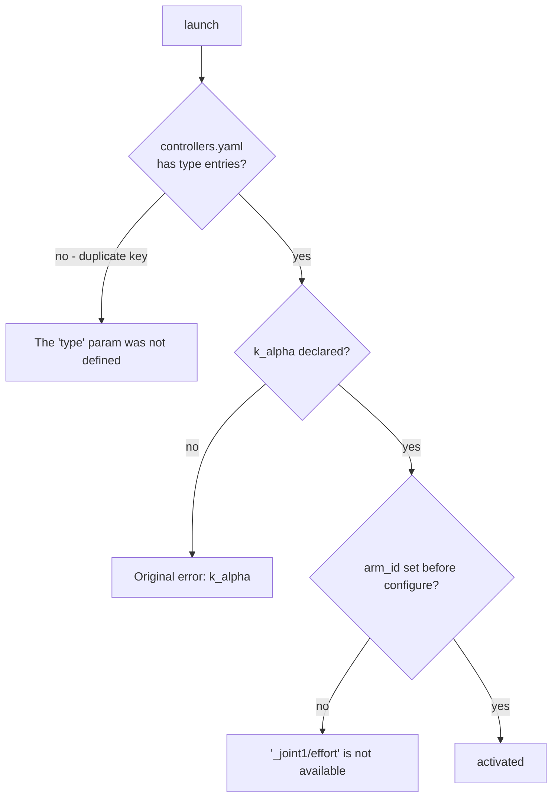
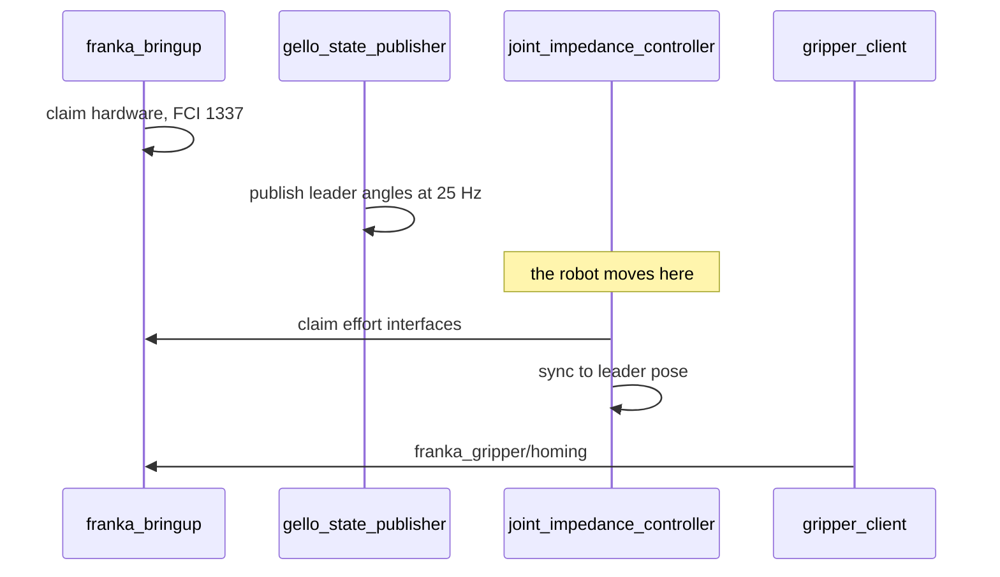

# GELLO-Feetech-FR3

**한국어** → [README.ko.md](README.ko.md)

**Feetech STS3215 · U-Arm Config3 · Franka Research 3 · ROS 2 Jazzy**

A 7-DoF GELLO leader arm built from servos that have no current control, driving a
Franka FR3 in joint space. GELLO assumes Dynamixel servos and current-based position
control. The STS3215 does not have that mode.

[Hardware](docs/hardware.md) · [Calibration](docs/calibration.md) · [Jazzy port notes](docs/ros2-jazzy-notes.md) · [Data collection](docs/data-collection.md) · [Patches](patches/)

---

## Contents

| Section | |
|---|---|
| [1. At a glance](#1-at-a-glance) | what was built, what is new |
| [2. Architecture](#2-architecture) | what was reused, what was written |
| [3. STS3215 constraints](#3-sts3215-constraints) | three consequences of no current mode |
| [4. Calibration](#4-calibration) | signs, offsets, gripper |
| [5. Porting to Jazzy](#5-porting-to-jazzy) | two upstream bugs, one build issue |
| [6. Running it](#6-running-it) | bring-up order |
| [7. Demonstration data](#7-demonstration-data) | 100 episodes, attribution |
| [8. Limitations](#8-limitations) | read before citing |
| [9. Related work](#9-related-work) | prior work and roadmap |
| [10. Credits and licensing](#10-credits-and-licensing) | |

---

## 1. At a glance


### Key facts

| | |
|---|---|
| Leader arm | 7 joints + gripper trigger, STS3215 C044 (1:191) ×8 |
| Frame | U-Arm Config3, printed |
| Sync read | ~**760 Hz** across 8 servos (publisher needs 25 Hz) |
| Follower | Franka Research 3, `franka_ros2` v3.4.1, `libfranka` 0.20.5 |
| New code | `FeetechDriver` — implements GELLO's `DynamixelDriverProtocol` |
| Upstream fixes | undeclared `k_alpha`, duplicate key in `controllers.yaml` |

### Three lines

```
1. No current control      -> GELLO's virtual spring is unavailable. Gravity comp is mechanical.
2. Single-turn encoder     -> without accumulation in the driver, the robot gets a full-turn command.
3. Upstream targets Humble -> two bugs that always fire on ros2_control 4.47.
```

### Questions this repository answers

| Question | Answer |
|---|---|
| Can GELLO run on servos without current control? | Yes. You lose gravity compensation. |
| How much has to be written? | One driver. `DynamixelDriverProtocol` is the seam. |
| Why doesn't GELLO build on Jazzy? | An undeclared parameter and a duplicate YAML key. One line each. |

---

## 2. Architecture



### Provenance by layer

| Layer | Source | State |
|---|---|---|
| Mechanical | U-Arm `Config3_STL` | Apache-2.0, unchanged |
| Servo SDK | `scservo_sdk` bundled with U-Arm | Apache-2.0, unchanged |
| **Leader driver** | **this repository** | **new** |
| State publisher | GELLO `franka_gello_state_publisher` | MIT, driver swapped |
| Arm controller | GELLO `franka_fr3_arm_controllers` | MIT, 2 Jazzy patches |
| Gripper | GELLO `franka_gripper_manager` | MIT, unchanged |
| Robot stack | `franka_ros2` v3.4.1 | runtime dependency |

**U-Arm's own software is not used.** Its roadmap has no ROS 2 support and its
`Follower_Arm/` directory covers ARX, Dobot, LeRobot and xArm — there is no Franka
follower. Only the printed parts and the bundled SDK are taken from it.

### The seam

One line in `gello_hardware.py`:

```python
# upstream
self._driver = DynamixelDriver(joint_ids, port=self._com_port, baudrate=57600)
# here
self._driver = FeetechDriver(joint_ids, port=self._com_port, baudrate=1000000)
```

This works because GELLO put the driver behind a `Protocol` and moved motor definitions
into YAML. The extension point was already there.

---

## 3. STS3215 constraints

| | Dynamixel XL330 (GELLO default) | Feetech STS3215 |
|---|---|---|
| Current / torque mode | yes | **none** |
| Encoder | 4095 counts/rev | 4096 counts/rev |
| Position register | multi-turn tracked | **single-turn, wraps 4095→0** |
| Baud rate | 57600 | 1000000 |
| Offset encoding | signed 4-byte | sign in bit 11 |

Operating modes are 0 = position, 1 = closed-loop velocity, 2 = open-loop velocity,
3 = step. Nothing else.

### Consequence 1 — no virtual spring

GELLO uses `OPERATING_MODE = 5` (current-based position) for gravity compensation. The
driver accepts `operating_mode`, `goal_current` and the PID registers, stores them, and
**never writes them to hardware.** Raising an exception instead would break
`gello_hardware.py`'s initialisation order, which writes those registers first.

Gravity compensation has to be mechanical.

### Consequence 2 — multi-turn accumulation


`gello_hardware.py` computes joint deltas assuming a continuous signal. One wrap
produces a −2π delta and commands a full revolution on the robot. The driver accumulates
turns so the published signal stays continuous, which leaves the upstream code untouched.

### Consequence 3 — motion is blocked

The leader arm is passive. The driver clamps `torque_enable` to 0 and swallows
`goal_position`, `goal_speed` and `acceleration` writes.

**Writing a goal position to an STS3215 implicitly engages torque.** During bring-up this
moved the arm unexpectedly. The block is deliberate — do not remove it.

---

## 4. Calibration



IDs are burned **before assembly** — afterwards the servos are buried inside the printed
links and breaking the daisy chain is awkward. The zero (`homing_offset`) is written
**once, after assembly**; it is an EEPROM write.

### Measured on this build

```yaml
joint_signs:       [-1, -1, -1, -1, -1, -1, -1]
assembly_offsets:  [0.0307, 5.6941, 6.0792, 4.1924, 0.1672, 0.2163, 2.9683]  # rad
gripper_range_rad: [4.0298, 2.3761]   # [closed, open]
```

`joint_signs` differs from GELLO's Franka default `[1, -1, 1, -1, 1, 1, 1]`. Config3 is
not a scaled replica of the FR3 — it shares the joint topology but not the link
geometry, so servo mounting direction has to be measured.

### The π in the offset

```
assembly_offset = (raw - (q_ref + π) × sign) mod 2π
```

`GelloHardware.normalize_joint_positions` wraps into `[mid−π, mid+π)`. Leave the π out
and J4 lands outside its limit, where `np.clip` pins it and the joint stops responding.
GELLO's own defaults (`[0, 0, 3.142, 3.142, 3.142, 4.712, 0]`) are π and 3π/2 for the
same reason.

`measure_all.py` feeds its result back through `normalize_joint_positions` and **only
saves if every joint reconstructs to `q_ref` and lands inside its limit.** Values that
fail the check are not written.

Full procedure: [docs/calibration.md](docs/calibration.md).

---

## 5. Porting to Jazzy

GELLO's `ros2/` targets Humble. Three things broke on Jazzy with `ros2_control` 4.47.0.



| # | Problem | Cause |
|---|---|---|
| 1 | `k_alpha` never declared | `on_init` does not declare it, `on_configure` reads it. 4.x no longer auto-declares params-file entries |
| 2 | duplicate key in `controllers.yaml` | two `/**:` blocks. YAML keeps the last, so the `controller_manager` block disappears |
| 3 | tests do not compile | `init()` signature changed. Build with `-DBUILD_TESTING=OFF`. Runtime code is unaffected |

Number 1 is an **upstream bug** — any `ros2_control` recent enough to have dropped
implicit declaration will hit it. Number 2 fires first, which is why the `k_alpha` error
only appears after fixing it.

The full record — orphaned processes, FCI ports 1337/1338, DDS domain collisions — is in
[docs/ros2-jazzy-notes.md](docs/ros2-jazzy-notes.md).

---

## 6. Running it



```bash
# A - hardware
ros2 launch franka_bringup franka.launch.py \
  robot_type:=fr3 robot_ip:=<ip> load_gripper:=true use_fake_hardware:=false

# B - leader publisher
ros2 launch franka_gello_state_publisher main.launch.py config_file:=<your>.yaml

# C - controller.  the robot moves.
ros2 run controller_manager spawner joint_impedance_controller \
  --param-file <path>/controllers.yaml

# D - gripper
ros2 launch franka_gripper_manager franka_gripper_client.launch.py \
  config_file:=example_fr3_config_franka_hand.yaml
```

**The order is fixed.** The gripper client waits on the `franka_gripper/homing` action
server that `franka_bringup` provides; starting it first times out after ten seconds.

The robot moves to the leader's pose the moment the controller activates. Check that the
leader angles are clear of the joint limits before that.

---

## 7. Demonstration data

100 teleoperation episodes were recorded on the FR3 with this leader arm: picking up a
black bowl and placing it on a plate, adapted from LIBERO-Spatial task 0. Two cameras
(wrist and agent view).

### Attribution

| | |
|---|---|
| Leader arm build, calibration | this project |
| ROS 2 integration, deployment | this project |
| Recording the 100 episodes | this project |
| **Policy fine-tuning** | **a colleague, on separate hardware** |
| Running the checkpoint on the FR3 | this project |

### Result

The fine-tuned GR00T N1.7 checkpoint was run on the FR3. The arm approaches the object
under policy control.

**Grasp success rate was not measured.** No trial count, no success criterion, no
baseline. The observation is qualitative — the approach phase looks reasonable, the
grasp outcome is unconfirmed.

Not calling this a success is deliberate. 100 episodes is a small dataset, and "it moved
toward the object" is not evidence that the policy learned the task. What a real
evaluation would need is listed in [docs/data-collection.md](docs/data-collection.md).

---

## 8. Limitations

| # | | |
|---|---|---|
| 1 | **No gravity compensation** | C044 (1:191) on all eight joints; the original design puts C001 (1:345) on J2. The arm does not hold the reference pose unaided |
| 2 | **Calibration repeatability** | 10–17° spread on the pitch joints between runs. A direct consequence of 1 |
| 3 | **No velocity clamp** | Leader angles pass through unfiltered. Fast motion can trigger a Franka reflex |
| 4 | **1 kHz overrun** | Missed cycles occur even before the impedance controller loads. The test machine runs a `PREEMPT_DYNAMIC` kernel |
| 5 | **One UDP timeout** | `libfranka: UDP receive: Timeout` deactivated the hardware once during bring-up |
| 6 | **Tracking error unmeasured** | Leader-to-follower RMS error and latency were not recorded |
| 7 | **Grasp success unmeasured** | See section 7 |
| 8 | **Leader does not resemble the follower** | Config3 covers five robot families by sharing joint topology only, so it is less intuitive than a true GELLO replica |

Items 4–6 all come out of a single `ros2 bag record` during a normal session. Planned,
not done.

---

## 9. Related work

| | |
|---|---|
| [Libero-GR00T-in-IsaacSim](https://github.com/SungjinDavidLee/Libero-GR00T-in-IsaacSim) | Same author. Zero-shot transfer of the same GR00T policy family into Isaac Sim, measured over 500 episodes. Conclusion: what breaks across simulators is the action-space convention, not the policy |

This repository is the next step — conventions verified in simulation, then moved to a
real robot.

### Roadmap

- [ ] Leader-to-follower tracking error and latency (`ros2 bag`)
- [ ] J2 torsion spring for gravity droop
- [ ] Velocity clamp and low-pass filter on the leader signal
- [ ] Port the same pipeline to a Fairino FR5

---

## 10. Credits and licensing

Original work under MIT ([LICENSE](LICENSE)), deriving from two upstream projects.
Full attribution in [NOTICE](NOTICE).

| Project | License | Used |
|---|---|---|
| [GELLO](https://github.com/wuphilipp/gello_software) | MIT, © 2023 Philipp Wu | three ROS 2 packages, driver interface |
| [LeRobot-Anything-U-Arm](https://github.com/MINT-SJTU/LeRobot-Anything-U-Arm) | Apache-2.0, MINT-SJTU | Config3 mechanical, `scservo_sdk` |
| [franka_ros2](https://github.com/frankarobotics/franka_ros2) | Apache-2.0 | runtime dependency |

`patches/01` is a pull request candidate for
[wuphilipp/gello_software](https://github.com/wuphilipp/gello_software).

---

## Layout

```
driver/     FeetechDriver, STS3215 control table generated from SDK constants
patches/    Jazzy compatibility fixes with rationale
tools/      servo ID assignment, sign/offset measurement, diagnostics
config/     leader config example, udev rule
docs/       hardware, calibration, port notes, data collection
assets/     diagrams
```
